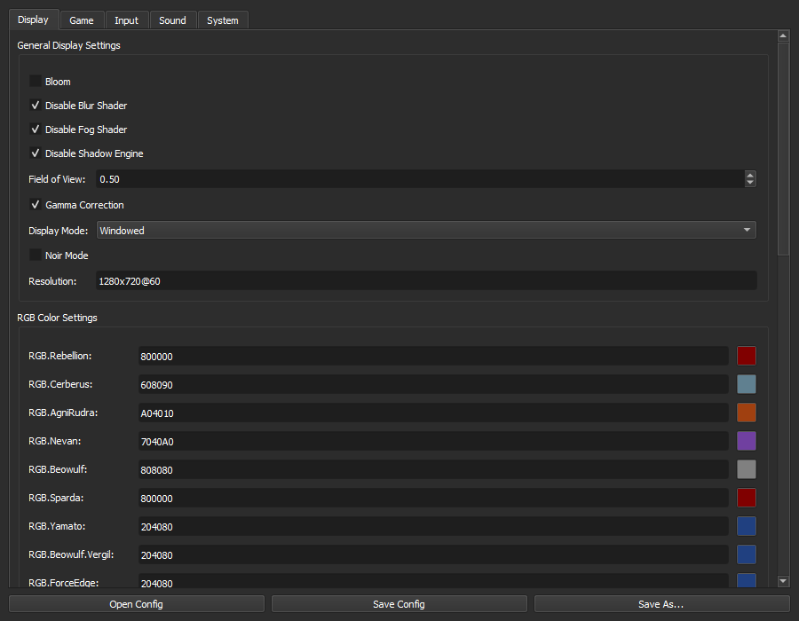
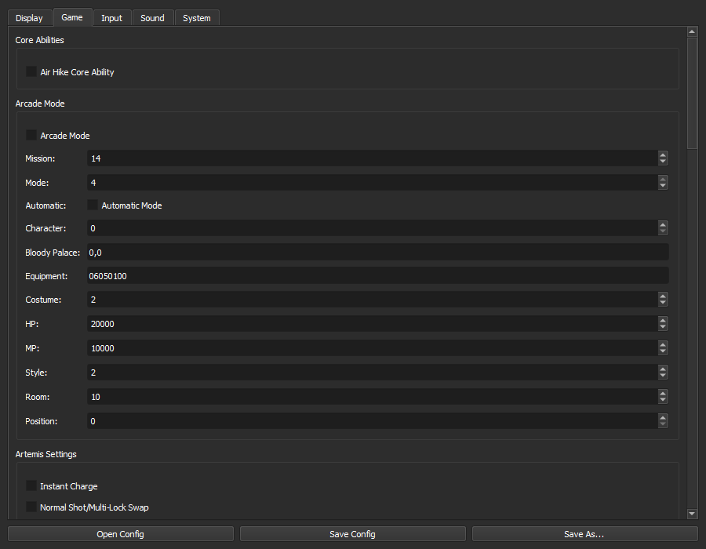
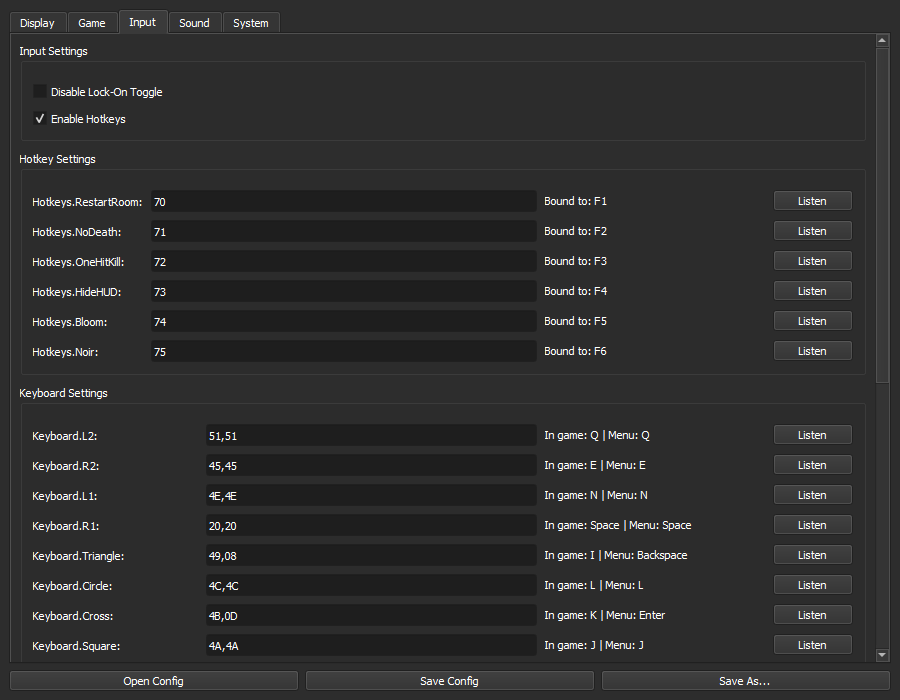
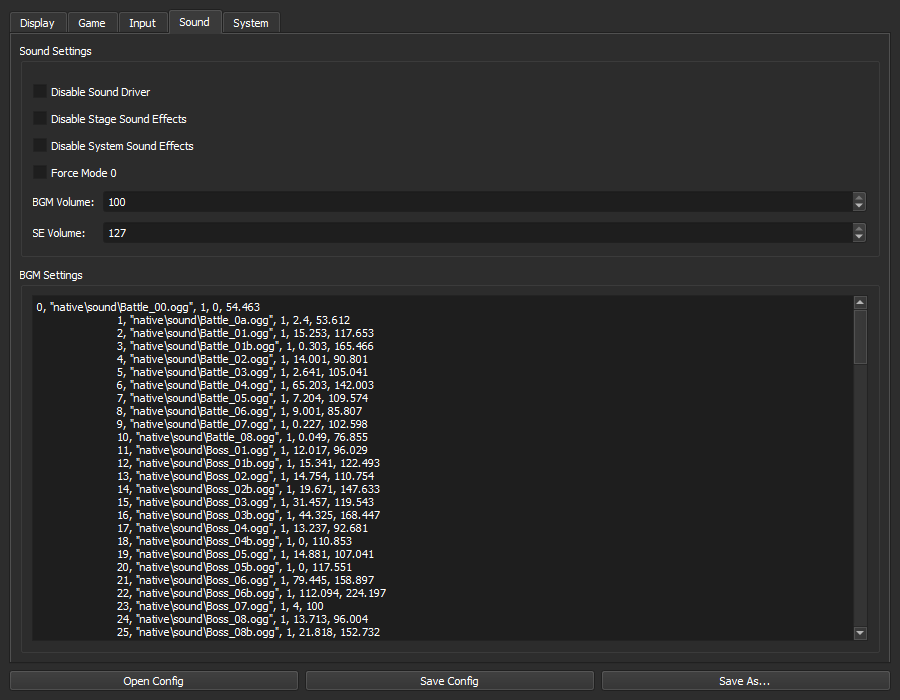
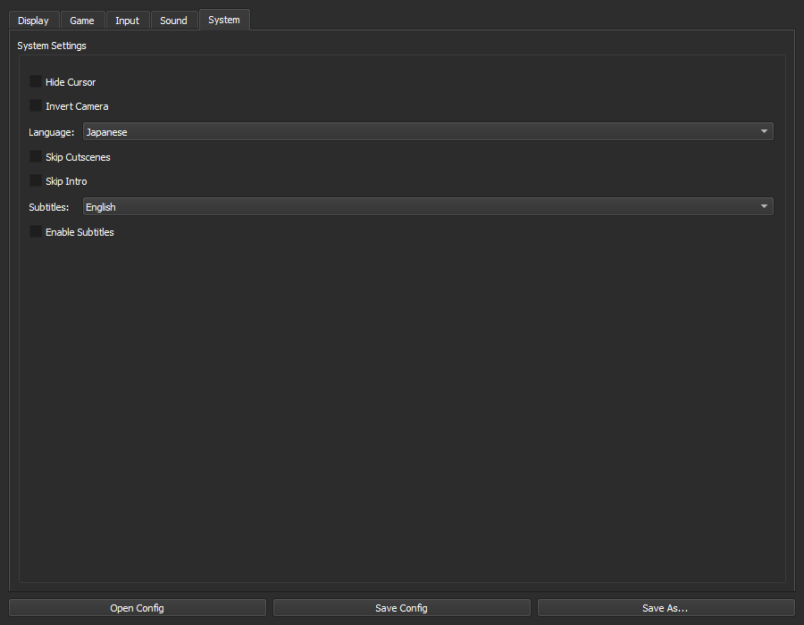

# StyleSwitcher GUI

A graphical user interface for editing the `StyleSwitcher.ini` configuration file for the [DMC3 StyleSwitcher mod](https://www.nexusmods.com/devilmaycry3/mods/10).

---

## Screenshots

### Display Tab — General settings, FOV, display mode, and per-weapon RGB colour picker


Colour fields show a live preview swatch next to each hex value. Click the swatch to open the colour picker.

### Game Tab — Core abilities, Arcade mode, Artemis, and other gameplay options


### Input Tab — Hotkeys and full keyboard remapping with live rebind


Keybind fields display a human-readable label alongside the stored hex code (e.g. `70` → **Bound to: F1**, `51,51` → **In game: Q | Menu: Q**). Click **Listen** on any row then press a key to rebind it instantly. Press **Escape** to cancel.

### Sound Tab — Volume controls and BGM track list


### System Tab — Language, subtitles, and cutscene options


---

## Features

- **Dark theme** — Fusion palette applied by default for comfortable low-light use
- **Per-weapon colour picker** — Click the colour swatch next to any RGB field to pick a colour; the swatch updates live as you type a hex value
- **Human-readable keybind labels** — Every hotkey and keyboard mapping field shows which key it is currently bound to
- **Live rebind capture** — Click **Listen**, press any key, and the binding is written immediately; press **Escape** to cancel
- Full coverage of all `StyleSwitcher.ini` options across five tabs: Display, Game, Input, Sound, System
- Automatically loads `StyleSwitcher.ini` from the same directory on startup
- Save / Save As / Open Config buttons

---

## Installation

### Standalone (Windows)

Download the latest release from the [Releases](../../releases) page and run `StyleSwitcherGUI.exe`. No Python required.

### From source

1. Requires Python 3.8 or newer and PyQt5:
   ```
   pip install -r requirements.txt
   ```
2. Run:
   ```
   python styleswitcher_gui.py
   ```

---

## Usage

1. Launch the application. It will automatically load `StyleSwitcher.ini` from its own directory if found.
2. If no file is found, click **Open Config** and browse to your `StyleSwitcher.ini`.
3. Edit settings across the five tabs as needed.
4. Click **Save Config** to write changes back, or **Save As…** to save a copy elsewhere.

> **Tip:** Always keep a backup of your original `StyleSwitcher.ini` before making changes.

---

## Building a distribution

```bat
build_dist.bat
```

Output will be in `dist\StyleSwitcherGUI\`.

---

## Requirements (source)

- Python 3.8+
- PyQt5
